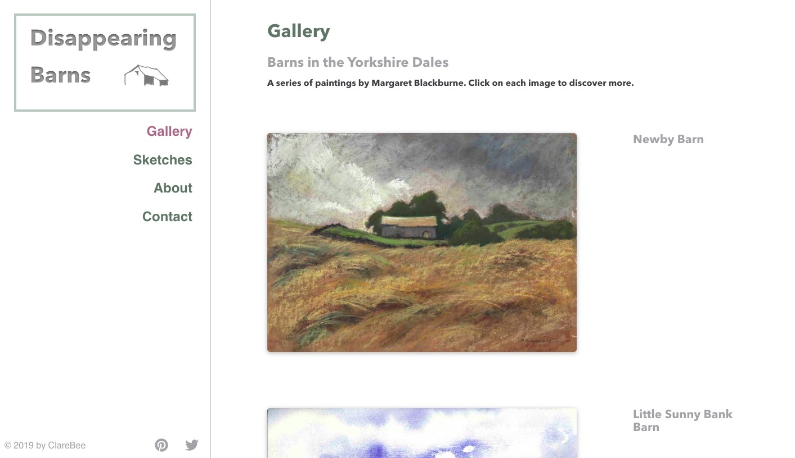
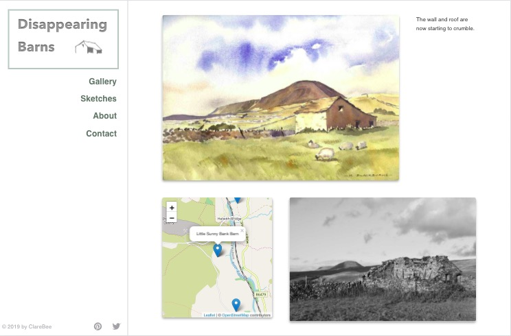

## 🚀 Quick start

`npm start` launches app on `localhost:8000`

## Features
- LeafletJS to show location of paintings
- Contact Form with Netlify
- Styling with Emotion
- Google Analytics and SEO
  
---

---

